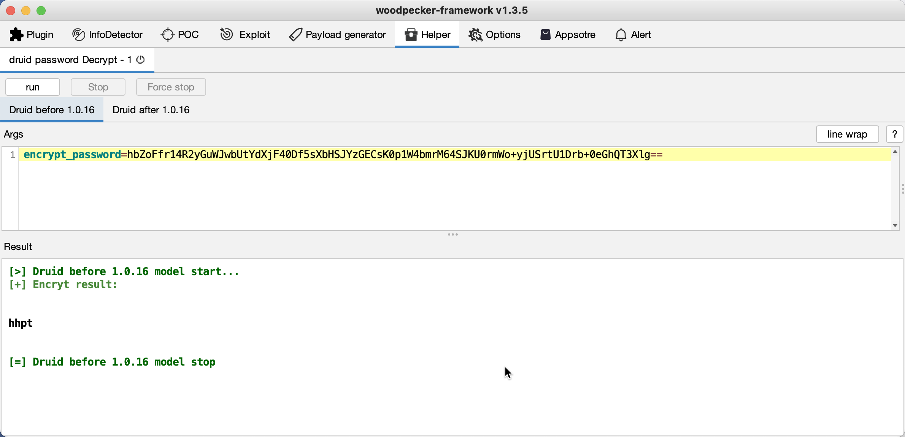
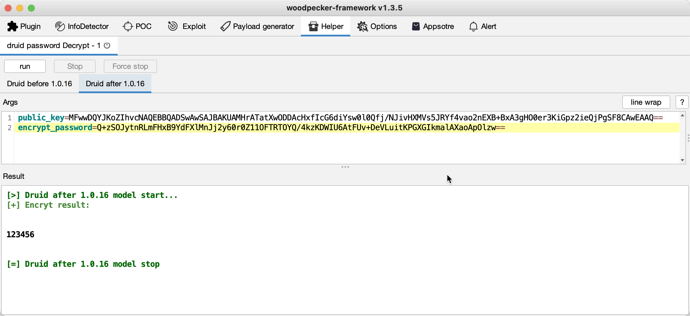

## 0x01 简介

druid-decrypter是一款用于解密druid加密过的数据库连接密码的woodpecker插件。目前支持druid `< 1.0.16`和`>= 1.0.16`两个版本范围的解密。

## 0x02 演示

#### < 1.0.16

#### >= 1.0.16

## 0x03 参考文献
- [druid密码解密](https://mp.weixin.qq.com/s?__biz=MzkzNzE4MTk4Nw==&mid=2247483768&idx=1&sn=b09fde87bc62cc9f421cf00672553b0f)